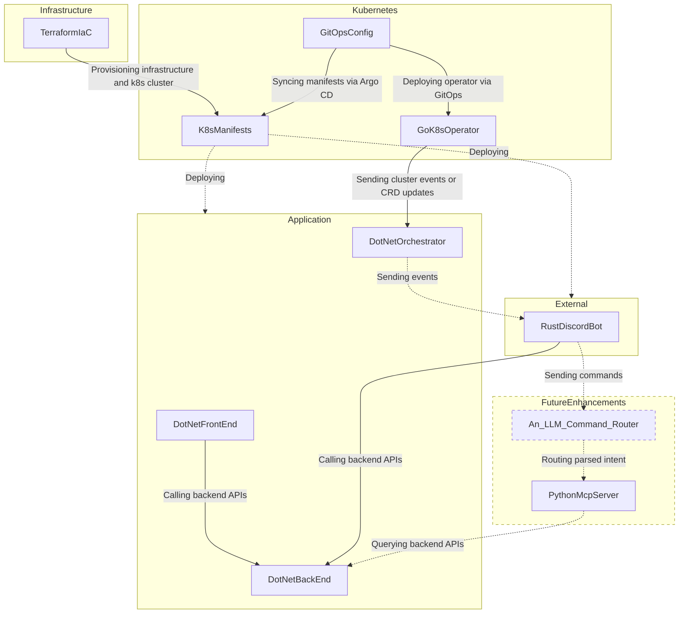

# Welcome

:suspect: My name is Victor, and this is my professional portfolio that contains different repositories to showcase my skills to the interested.

In the following of this README, you will find my [soft](#soft-skills) & [hard](#hard-skills) skills that will give you an oversight of what I am capable of when working in a professional environment.

> French school taugh me to avoid being wrong at all cost. My professional experience with Ukrainians teammates told me otherwise. Now I like being wrong and to own it, it motivates me learning and improve.

# Soft skills

- I'm a **very** collaborative teammate, I work with people every day with passion and smile on my face, _especially when we are firefighting in production_. I'm highly communicative (verbally and in writing), if there is a tension, I'm going to talk to you about it, even if you would rather avoid it :feelsgood:.
- Working with other people is **essential** for me. Sitting alone in a corner would slowly kill me. Developping software alone is **slow**, **lacks** of knowledge **sharing**, **not challenging**, and frankly... **sad**.
- I am a proactive engineer, I will raise concerns, share ideas, and will assume any responsability you want me to take. I've led teams accross the world (mostly Ukraine, Portugal, and some from the United-States), and we always managed to deliver applications that built trust and credibility :fire:.
- I'm **not** an **over**-engineer. I know time is a **very valuable** resource, and I will always evaluate the tradeoffs and think before building or validating any part of a software. I am never going to spend multiple days on insignificant task, just for the fun of it. I am not a cat chasing butterflies.
- I pay attention to detail. You'll probably wonder how I spotted something in your PR that you missed.
- I love input from others, I dislike building something alone: I know I could be missing something obvious to someone else. (Now we have AI, sure, but AI is so bad when it doesn't have the whole context of a project :rage4:)
- I love solving problems. That's what engineering is about. Repetitive tasks with no creativity aren't my thing. I naturally lean toward the hardest problems first.
> :arrow_right_hook: In some scenarios where priority is onto the most boring task, I've been told that it can be considered as a weakness. And I agree, that's why I am still doing these boring tasks when needed.
- Do you want to onboard me on a tech I don't know yet ? No problem. Give me _`<timescale according to complexity of the subject goes here>`_ of experiment and I will have strong basics. I've done this many times before.
- My main goal will always be client satification :100:
- There is a high chance that I send GIF memes to my coworkers :trollface:

# Hard skills

## Real life examples

### Idea

In order to develop a meaningful application that would cover most of the tech I want to showcase in this organization, I need a real life scenario project (_to have real features implemented instead of Hello Worlds_). 

> In this scope, I decided to develop and deploy a Single Player Tarkov cooperative dashboard for me and my friends for our milsim sessions on Discord. You will not hear about it in the following of this portfolio (other than code itself) because:
> 1. You don't care about SPT, and won't use such product.
> 2. You are here for getting an overview of my hard skills, not for (head, eyes) gameplay.

### Repository

You can see working examples in the different repositories that comes in this organization:

- [**coming soon**] [TerraformIaC](https://github.com/VictorMalodPortfolio/TerraformIaC): Terraform modules and configs for provisioning infrastructure
- [**coming soon**] [K8sManifests](https://github.com/VictorMalodPortfolio/K8sManifests): Helm charts, Kubernetes manifests, CRDs
- [**coming soon**] [GitOpsConfig](https://github.com/VictorMalodPortfolio/GitOpsConfig): Argo CD apps, environment overlays, Helm values, sealed secrets
- [**coming soon**] [DotNetFrontEnd](https://github.com/VictorMalodPortfolio/DotNetFrontEnd): A .NET10 Blazor Server Frontend
- [**coming soon**] [DotNetBackEnd](https://github.com/VictorMalodPortfolio/DotNetBackEnd): An ASP.NET10 Backend API
- [**coming soon**] [DotNetOrchestrator](https://github.com/VictorMalodPortfolio/DotNetOrchestrator): A .NET10 Application orchestrating business logic
- [**coming soon**] [RustDiscordBot](https://github.com/VictorMalodPortfolio/RustDiscordBot): A discord bot coded in Rust
- [**coming soon**] [GoK8sOperator](https://github.com/VictorMalodPortfolio/GoK8sOperator): A K8s operator coded in Golang
- [**coming soon**] [PythonMcpServer](https://github.com/VictorMalodPortfolio/PythonMcpServer): A MCP server coded in Python

## Tools

### The programing languages that I've liked using

- C# 
- Go 
- Java
- Python
- C
- GSC

### The frameworks I have worked with

- .NET (including Framework & Core): 
  - Aspire 
  - ASP.NET
  - Entity Framework
  - xUnit 
  - Blazor
- Azure: 
  - .NET SDK (including emulators)
  - App Service
  - Functions (previously WebJobs)
  - LogicApps
- Open Telemetry
- Go Testify
- Black Ops 3 Mod Tools
<!-- AWS: -->
<!-- OVH: -->

### IaC tools I've used

- Terraform
- ARM Template
<!-- helm chart -->
<!-- ansible -->
<!-- Bicep -->

### Containerization & Registries

<!-- kubernetes -->
<!-- podman -->
- Docker
- Azure Container Apps
- Azure Container Instance (yikes)
- Azure Container Registries
- JFrog Artifactory

### CI/CD

- Azure DevOps pipelines (& release)
- GitHub actions

### Quality & Security

- SonarQube
- Trivy
- BlackDuck

### Monitoring & Observability

- OpenTelemetry (in .NET Aspire & Azure AppInsights)
- Dynatrace
- Prometheus
- Jaeger
- Log4Net
- Azure AppInsights's .NET TelemetryClient
