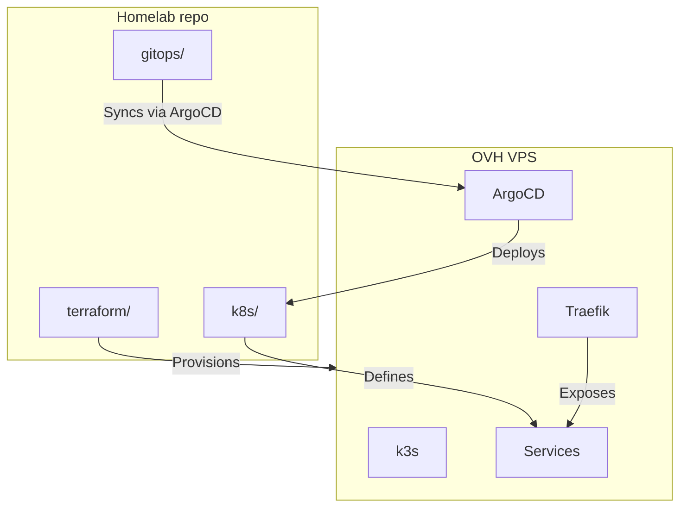

# Welcome

:suspect: My name is Victor, and this is my professional portfolio that contains different repositories to showcase my skills to the interested.

In the following of this README, you will find my [soft](#soft-skills) & [hard](#hard-skills) skills that will give you an oversight of what I am capable of when working in a professional environment.

> French school taugh me to avoid being wrong at all cost. My professional experience with Ukrainians teammates told me otherwise. Now I like being wrong and to own it, it motivates me learning and improve.

# Soft skills

- I'm a **very** collaborative teammate, I work with people every day with passion and smile on my face, _especially when we are firefighting in production_. I'm highly communicative (verbally and in writing), if there is a tension, I'm going to talk to you about it, even if you would rather avoid it :feelsgood:.
- Working with other people is **essential** for me. Sitting alone in a corner would slowly kill me. Developping software alone is **slow**, **lacks** of knowledge **sharing**, **not challenging**, and frankly... **sad**.
- I am a proactive engineer, I will raise concerns, share ideas, and will assume any responsability you want me to take. I've led teams accross the world (mostly Ukraine, Portugal, India and some from the United-States), and we always managed to deliver applications that built trust and credibility :fire:.
- I'm **not** an **over**-engineer. I know time is a **very valuable** resource, and I will always evaluate the tradeoffs and think before building or validating any part of a software. I am never going to spend multiple days on insignificant task, just for the fun of it. I am not a cat chasing butterflies.
- I pay attention to detail. You'll probably wonder how I spotted something in your PR that you missed.
- I love input from others, I dislike building something alone: I know I could be missing something obvious to someone else. (Now we have AI, sure, but AI is so bad when it doesn't have the whole context of a project :rage4:)
- I love solving problems. That's what engineering is about. Repetitive tasks with no creativity aren't my thing. I naturally lean toward the hardest problems first.
> :arrow_right_hook: In some scenarios where priority is onto the most boring task, I've been told that it can be considered as a weakness. And I agree, that's why I am still doing these boring tasks when needed.
- Do you want to onboard me on a tech I don't know yet ? No problem. Give me _`<timescale according to complexity of the subject goes here>`_ of experiment and I will have strong basics. I've done this many times before.
- My main goal will always be client satification :100:
- There is a high chance that I send GIF memes to my coworkers :trollface:

# Hard skills

## Real life examples

### Idea

To showcase infrastructure and platform engineering skills with real, working examples rather than hello worlds, I built a personal Kubernetes homelab deployed on a VPS.

The goal: a self-hosted, always-on platform where I can deploy, test, and iterate on anything — provisioned with Terraform, managed with GitOps.

### Repositories

- [Homelab](https://github.com/VictorMalodPortfolio/Homelab): OVH VPS provisioning, k3s cluster, Helm charts, Kubernetes manifests, and ArgoCD GitOps configuration — the full platform, end to end
- [DockerTooling](https://github.com/VictorMalodPortfolio/DockerTooling): Dockerfile for an isolated, reproducible development environment with all necessary tooling pre-installed

## Tools

### The programing languages that I've liked using

- C# 
- Go 
- Java
- Python
- C
- GSC

### The frameworks I have worked with

- .NET (including Framework & Core): 
  - Aspire 
  - ASP.NET
  - Entity Framework
  - xUnit 
  - Blazor
- Azure: 
  - .NET SDK (including emulators)
  - App Service
  - Functions (previously WebJobs)
  - LogicApps
- Open Telemetry
- Go Testify
- Black Ops 3 Mod Tools
<!-- AWS: -->
<!-- OVH: -->

### IaC tools I've used

- Terraform
- ARM Template
<!-- helm chart -->
<!-- ansible -->
<!-- Bicep -->

### Containerization & Registries

<!-- kubernetes -->
<!-- podman -->
- Docker
- Azure Container Apps
- Azure Container Instance (yikes)
- Azure Container Registries
- JFrog Artifactory

### CI/CD

- Azure DevOps pipelines (& release)
- GitHub actions

### Quality & Security

- SonarQube
- Trivy
- BlackDuck

### Monitoring & Observability

- OpenTelemetry (in .NET Aspire & Azure AppInsights)
- Grafana 
- Grafana OTel Stack (Tempo / Loki / Prometheus)
- Dynatrace
- Jaeger
- Log4Net
- Azure AppInsights's .NET TelemetryClient

